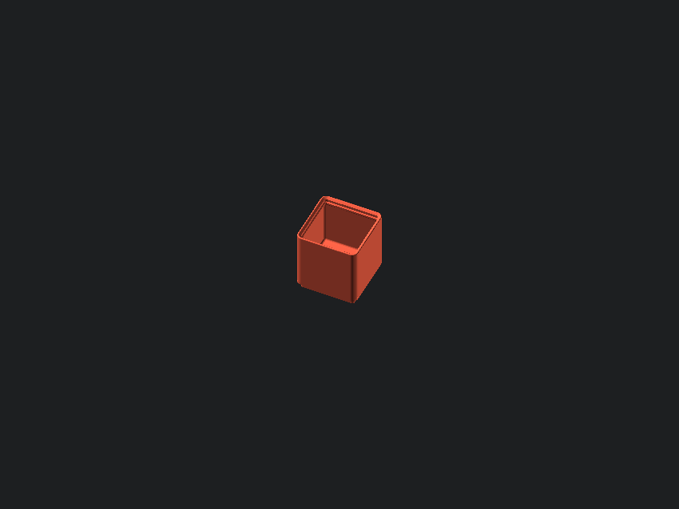
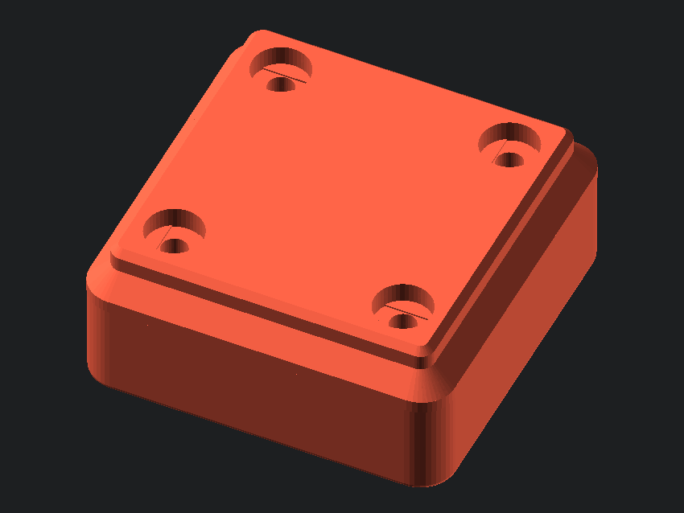
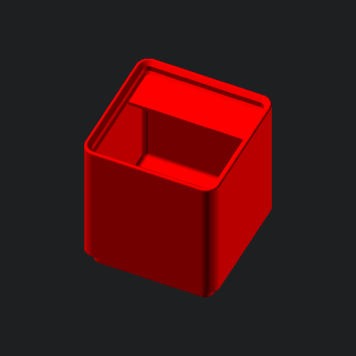

# Gridfinity Rebuilt in OpenSCAD 

A ground-up port (with a few extra features) of the stock [gridfinity](https://www.youtube.com/watch?v=ra_9zU-mnl8) bins in OpenSCAD. Open to feedback, because I could not feasibly test all combinations of bins. I tried my best to exactly match the original gridfinity dimensions, but some of the geometry is slightly incorrect (mainly fillets). However, I think they are negligible differences, and will not appear in the printed model. 

Full documentation can be found at the project's [website](https://kennetek.github.io/gridfinity-rebuilt-openscad/).

The project can also be found on [Printables](https://www.printables.com/model/274917-gridfinity-rebuilt-in-openscad) if you want to support the project.

## Features
- any size of bin (width/length/height)
- height by units, internal depth, or overall size
- any number of compartments (along both X and Y axis)
- togglable scoop
- togglable tabs, split tabs, and tab alignment
- togglable holes (with togglable supportless printing hole structures)
- manual compartment construction (make the most wacky bins imaginable)
- togglable lip (if you don't care for stackability)
- dividing bases (if you want a 1.5 unit long bin, for instance)
- removed material from bases to save filament
- vase mode bins

### Printable Holes
The printable holes allow your slicer to bridge the gap inside the countersunk magnet hole (using the technique shown [here](https://www.youtube.com/watch?v=W8FbHTcB05w)) so that supports are not needed.

## Recommendations
For best results, use a version of OpenSCAD with the fast-csg feature. As of writing, this feature is only implemented in the [development snapshots](https://openscad.org/downloads.html). To enable the feature, go to Edit > Preferences > Features > fast-csg. On my computer, this sped up rendering from 10 minutes down to a couple of seconds, even for comically large bins.  

## Enjoy!

[Gridfinity](https://www.youtube.com/watch?v=ra_9zU-mnl8) by [Zack Freedman](https://www.youtube.com/c/ZackFreedman/about)

This work is licensed under the same license as Gridfinity, being a 
[MIT License](https://opensource.org/licenses/MIT).

