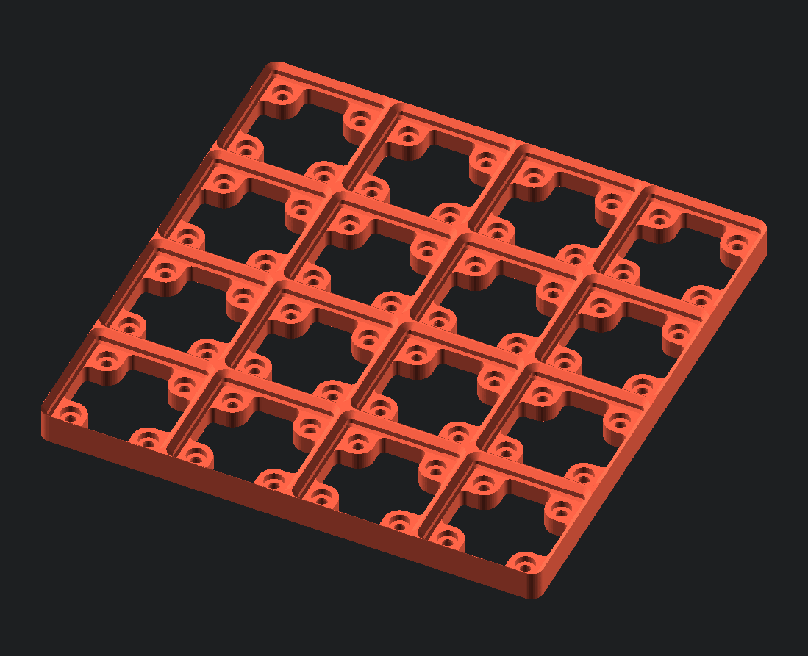

# gridfinity-rebuilt-baseplate

To round out the rebuilt catalog, we have baseplates. Originally, baseplates were not included as there was not anything really interesting to parameterize, unlike with bins. However, upon closer inspection, there is a couple things that would make peoples' lives easier. For instance, what is called here the "skeletonized" style, in that the baseplate is still thick to allow for magnets, but the center portion is removed. Additionally, being able to generate spacers for the sides of the bases, so that they fit perfectly inside your drawers.

## Script Parameters

Parameter | Range | Description
--- | ----- | ---
gridx | { n>=0 \| n∈R } | number of bases along the x-axis  If set to zero, will fill with as many  bases that fit within `distancex`
gridy | { n>=0 \| n∈R } | number of bases along the y-axis  If set to zero, will fill with as many  bases that fit within `distancey`
length | { n>0 \| n∈R } | length of one unit of the base.   default: 42 (The Answer to the Ultimate Question of Life,  the Universe, and Everything.)
distancex | { n>0 \| n∈R } | minimum length of baseplate along x  alternatively, how large is the drawer along x  (leave zero to ignore)
distancey | { n>0 \| n∈R } | minimum length of baseplate along y  alternatively, how large is the drawer along y  (leave zero to ignore)
fitx | { -1<=n<=1 \| n∈R } | alignment factor for extra space along x axis
fity | { -1<=n<=1 \| n∈R } | alignment factor for extra space along y axis
style_plate | { 0, 1, 2 } | the style of baseplate       • (0) thin (minimum material, only outline)       • (1) weighted (thick with space for tire iron)       • (2) skeletonized (thick, center hollowed) 
enable_magnet | boolean | toggle hole for magnet on top
style_hole | { 0, 1, 2 } | the style of holes underneath the baseplate, if applicable       • (0) none       • (1) countersink       • (2) counterbore

## Modules

### gridfinityBaseplate

Generates a baseplate to use with gridfinity bins. 

** `gridfinityBaseplate(gridx, gridy, length, distancex, distancey, style_plate, enable_magnet, style_hole)` **

Parameter | Range | Description
--- | ----- | ---
gridx | { n>=0 \| n∈R } | number of bases along the x-axis  If set to zero, will fill with as many  bases that fit within `distancex`
gridy | { n>=0 \| n∈R } | number of bases along the y-axis  If set to zero, will fill with as many  bases that fit within `distancey`
length | { n>0 \| n∈R } | length of one unit of the base.   default: 42 (The Answer to the Ultimate Question of Life,  the Universe, and Everything.)
distancex | { n>0 \| n∈R } | minimum length of baseplate along x  alternatively, how large is the drawer along x  (leave zero to ignore)
distancey | { n>0 \| n∈R } | minimum length of baseplate along y  alternatively, how large is the drawer along y  (leave zero to ignore)
fitx | { -1<=n<=1 \| n∈R } | alignment factor for extra space along x axis
fity | { -1<=n<=1 \| n∈R } | alignment factor for extra space along y axis
style_plate | { 0, 1, 2 } | the style of baseplate       • (0) thin (minimum material, only outline)       • (1) weighted (thick with space for tire iron)       • (2) skeletonized (thick, center hollowed) 
enable_magnet | boolean | toggle hole for magnet on top
style_hole | { 0, 1, 2 } | the style of holes underneath the baseplate, if applicable       • (0) none       • (1) countersink       • (2) counterbore