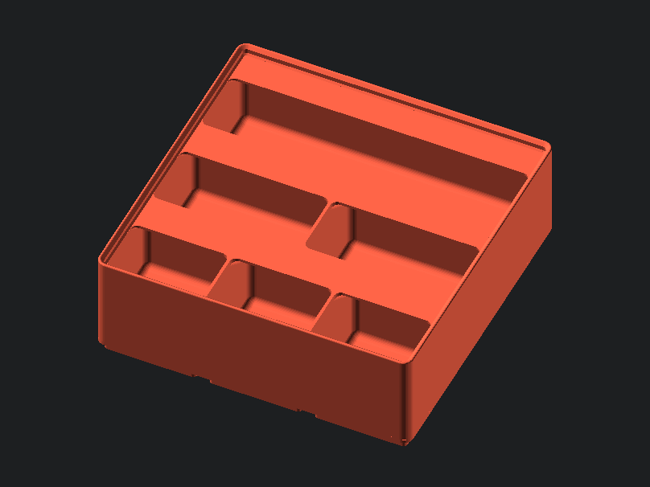

# gridfinity-rebuilt-bins

Generates stock bins, with a great number of variations. 



## Script Parameters

Parameter | Range | Description
--- | ----- | ---
gridx | { n>0 \| n∈R } | number of bases along the x-axis  
gridy | { n>0 \| n∈R } | number of bases along the y-axis  
gridz | { n>0 \| n∈R } | bin height. See bin height information and "gridz_define" below.  
length | { n>0 \| n∈R } | length of one unit of the base. <br> default: 42 (The Answer to the Ultimate Question of Life, <br>the Universe, and Everything.)
divx | { n>0 \| n∈Z }  | number of compartments along X
divy | { n>0 \| n∈Z }  | number of compartments along Y
scoop | n>0 \| n∈R | controls the fillet on the bottom of the compartment for easy <br> item removal. 0 is disabled, 1 is full, any other real number will <br> scale from full. 
enable_zsnap | boolean | automatically snap the bin size to the nearest 7mm increment. <br> default: true
style_lip | {0, 1, 2} | if you are not stacking the bin, you can disable the top lip <br> to save space. <br>     • (0) Regular lip <br>     • (1) Subtract lip to save space <br>     • (2) Disable lip while retaining height
gridz_define | { n>0 \| n∈R } | determine what the variable "gridz" applies to based on <br> your use case. default: 0. <br>     • (0) gridz is the height in # of 7mm increments (Zack) <br>     • (1) gridz is the internal height in millimeters <br>     • (2) gridz is the overall external height of the bin in millimeters
height_internal | { n>0 \| n∈R } | height of the internal block. <br> Can be lower than bin height to save filament on custom bins. <br> default of 0 means use the calculated height.
style_tab | { 0, 1, 2, 3, 4, 5 } | how the tabs for labels are generated. <br>     • (0) Full tabs across the entire compartment <br>     • (1) automatic tabs <br>     - left aligned tabs on the left edge<br>     - right aligned tabs on right edge<br>     -  center tabs otherwise <br>     • (2) left aligned tabs <br>     • (3) center aligned tabs <br>     • (4) right aligned tabs <br>     • (5) no tabs
style_hole | { 0, 1, 2, 3 } | the style of holes in the bases <br>     • (0) No holes <br>     • (1) Magnet holes only <br>     • (2) Magnet and screw holes - no printable slit <br>     • (3) Magnet and screw holes - with printable slit
div_base_x | { n>=0 \| n∈Z } | number of divisions per 1 unit of base along the X axis. <br>(default 1, only use integers. <br>0 means automatically guess the division)
div_base_y | { n>=0 \| n∈Z } | number of divisions per 1 unit of base along the Y axis. <br>(default 1, only use integers. <br>0 means automatically guess the division)

<br>

## Modules

---

### gridfinityInit

Initializes the top part of the bin (walls and solid section). All bins have to use this module, and have the compartments cut out from it. 

** `gridfinityInit (gridx, gridy, height, height_internal, length)` **

Parameter | Range | Description
--- | ----- | ---
gridx | { n>0 \| n∈R } | number of bases along the x-axis  
gridy | { n>0 \| n∈R } | number of bases along the y-axis  
height | { n>0 \| n∈R } | height of the bin, in millimeters (but not exactly). <br> See the `height()` function for more info.
height_internal | { n>0 \| n∈R } | height of the internal block. <br> Can be lower than bin height to save filament on custom bins. <br> default of 0 means use the calculated height.
length | { n>0 \| n∈R } | length of one unit of the base. <br> default: 42 (The Answer to the Ultimate Question of Life, <br>the Universe, and Everything.)

```
// Example: generate a 3x3x6 bin with a 42mm unit size
gridfinityInit(3, 3, height(6), 0, 42) {
	cutEqual(n_divx = 3, n_divy = 3, style_tab = 0, scoop_weight = 1);
}
```

---

### height

Calculates the proper height for bins. 
 
** `height (gridz, gridz_define, style_lip, enable_zsnap)` **

Parameter | Range | Description
--- | ----- | ---
gridz | { n>0 \| n∈R } | bin height. See bin height information and "gridz_define" below.  
gridz_define | { n>0 \| n∈R } | determine what the variable "gridz" applies to based on <br> your use case. default: 0. <br>     • (0) gridz is the height in # of 7mm increments (Zack) <br>     • (1) gridz is the internal height in millimeters <br>     • (2) gridz is the overall external height of the bin in millimeters
style_lip | {0, 1, 2} | if you are not stacking the bin, you can disable the top lip <br> to save space. <br>     • (0) Regular lip <br>     • (1) Subtract lip to save space <br>     • (2) Disable lip while retaining height
enable_zsnap | boolean | automatically snap the bin size to the nearest 7mm increment. <br> default: true

```
// Example: height for a 6 unit high bin
height(6);

// Example: height for a bin that can fit (at maximum) a 30mm high object inside
height(30, 1, 0, false); 
```

---

### gridfinityBase 

Generates the bases for bins. Has various different hole styles, and can be subdivided.

** `gridfinityBase (gridx, gridy, length, div_base_x, div_base_y, style_hole)`  **

Parameter | Range | Description
--- | ----- | ---
gridx | { n>0 \| n∈R } | number of bases along the x-axis  
gridy | { n>0 \| n∈R } | number of bases along the y-axis 
length | { n>0 \| n∈R } | length of one unit of the base. default: 42
div_base_x | { n>=0 \| n∈Z } | number of divisions per 1 unit of base along the X axis. <br>(default 1, only use integers. 0 means automatically guess the division)
div_base_y | { n>=0 \| n∈Z } | number of divisions per 1 unit of base along the Y axis. <br>(default 1, only use integers. 0 means automatically guess the division)
style_hole | { 0, 1, 2, 3 } | the style of holes in the bases <br>     • (0) No holes <br>     • (1) Magnet holes only <br>     • (2) Magnet and screw holes - no printable slit <br>     • (3) Magnet and screw holes - with printable slit

```
// Example: generate a 3x3 base with a 42mm unit size and clean magnet holes
gridfinityBase(3, 3, 42, 0, 0, 1);
```

---

### cutEqual

Generates the "traditional" bin cutters. It is a utility function that creates evenly distributed compartments. 

** `cutEqual (n_divx, n_divy, style_tab, scoop_weight)` **

Parameter | Range | Description
--- | ----- | ---
n_divx | { n>0 \| n∈Z }  | number of compartments along X
n_divy | { n>0 \| n∈Z }  | number of compartments along Y
style_tab | { 0, 1, 2, 3, 4, 5 } | how the tabs for labels are generated. <br>     • (0) Full tabs across the entire compartment <br>     • (1) automatic tabs <br>     - left aligned tabs on the left edge<br>     - right aligned tabs on right edge<br>     -  center tabs otherwise <br>     • (2) left aligned tabs <br>     • (3) center aligned tabs <br>     • (4) right aligned tabs <br>     • (5) no tabs
scoop | n>0 \| n∈R | controls the fillet on the bottom of the compartment for easy <br> item removal. 0 is disabled, 1 is full, any other real number will <br> scale from full.

```
// Example: this generates 9 compartments in a 3x3 grid, and all compartments have a full tab and a scoop
gridfinityInit(3, 3, height(6), 0, 42) {
	cutEqual(n_divx = 3, n_divy = 3, style_tab = 0, scoop_weight = 1);
}
```

---

### cut

Cuts a single compartment into the bin at the provided location with the provided attributes. The coordinate system for compartments originates (0,0) at the bottom left corner of the bin, where 1 unit is the length of 1 base. Positive X and positive Y are in the same direction as the global coordinate system.

** `cut (x, y, w, h, t, s)` **

Parameter | Range | Description
--- | ----- | ---
x | { n>=0 \| n∈R } | X coordinate of the compartment <br>(position of left edge of compartment)
y | { n>=0 \| n∈R } | Y coordinate of the compartment <br>(position of bottom edge of compartment)
w | { n>0 \| n∈R } | Width of the compartment, in base units <br>(1 unit = 1 `length`)
h | { n>0 \| n∈R } | Height of the compartment, in base units <br>(1 unit = 1 `length`)
t | { 0, 1, 2, 3, 4, 5 } | how the tabs for labels are generated for this compartment. <br>     • (0) Full tabs across the entire compartment <br>     • (1) automatic tabs <br>     - left aligned tabs on the left edge<br>     - right aligned tabs on right edge<br>     -  center tabs otherwise <br>     • (2) left aligned tabs <br>     • (3) center aligned tabs <br>     • (4) right aligned tabs <br>     • (5) no tabs
s | n>0 \| n∈R | controls the fillet on the bottom of the compartment for easy <br> item removal. 0 is disabled, 1 is full, any other real number will <br> scale from full, only for this specific compartment

```
// Example:
// this cuts two compartments that are both 1 wide and 2 high. 
// One is on the bottom left, and the other is at the top right. 
gridfinityInit(3, 3, height(6), 0, 42) {
    cut(0, 0, 1, 2, 0, 1);
    cut(2, 1, 1, 2, 0, 1);
}
```

---

### cut_move

Moves all of its children from the global origin to the center of the area that a compartment would normally fill, and uses them to cut from the bin. This allows you to easily make custom cutouts in the bin.

** `cut_move (x, y, w, h)` **

Parameter | Range | Description
--- | ----- | ---
x | { n>=0 \| n∈R } | X coordinate of the area (position of left edge)
y | { n>=0 \| n∈R } | Y coordinate of the area (position of bottom edge)
w | { n>0 \| n∈R } | Width of the area, in base units (1 unit = 1 `length`)
h | { n>0 \| n∈R } | Height of the area, in base units (1 unit = 1 `length`)

```
// Example:
// cuts a cylindrical hole of radius 5
// hole center is located 1/2 units from the right edge of the bin, and 1 unit from the top
gridfinityInit(3, 3, height(6), 0, 42) {
    cut_move(x=2, y=1, w=1, h=2) {
          cylinder(r=5, h=100, center=true);
    }
}
```