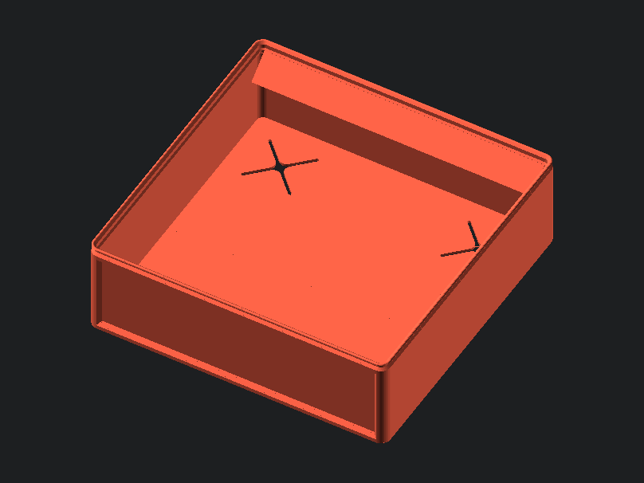
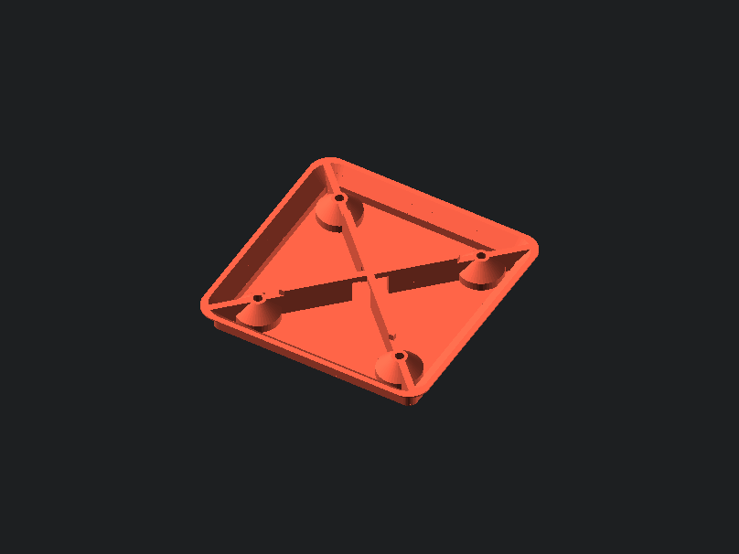

# gridfinity-spiral-vase

Some assembly required!
Adaptation of Gridfinity bins to work with spiral vase mode, as to save filament and print time. A big drawback of using vase mode for Gridfinity bins was that they would be very flimsy, and would lack the features that make Gridfinity such a good organizational tool. The goal of this implementation was to maintain the design philosophy while working under the constraints of vase mode. 

## Instructions
Normal Gridfinity is impossible to convert to vase mode due to the geometry of the bases, meaning most existing vase mode Gridfinity models are limited to 1x1 bins. How this script gets around the impossible is to use two separate pieces. **The bin and bases must be printed separately, and then glued together to form the final bin.** While this is slightly more work, there is an added bonus to this method, as for larger bins you may not need every single grid slot to have a base, you only really need them on the corners, or the edges, with some in the middle for support. Using less bases saves filament and print time.

All parameters are global. The customizer has descriptions for all parameters. It is **essential** that the section *Printer Settings* matches your preferred slicer's settings, otherwise the model will not slice correctly. Additionally, you have to turn on the spiral vase parameter in your slicer. If you do not know what vase mode is, [this](https://www.youtube.com/watch?v=HZSFoFYpBaA) is a helpful video. 

1. Change the *Printer Settings* parameters to match your slicer and printer settings.
2. Run the `gridfinityVaseBase()` module. This will generate a single spiral-capable base. Export as an STL file. You will need to print multiple of these, so it recommended to fill a base plate with them using the "complete individual objects" option (or equivilant) in your slicer. You only need to do this step initially, and then each time your printer settings change afterwards. 
3. Change the bin parameters and run `gridfinityVase()` module to generate the main bin. 
4. Glue bases to the bottom of the bin. I recommend superglue on the corners and the top of the magnet holes. 

How your sliced files should look (cross section shown for 1x1 bin):

Example sliced files can be found on the [Printables](https://www.printables.com/model/284371-spiral-vase-gridfinity-in-openscad) page. 

## Statistics
Given how it has become a bit of a [challenge](https://www.printables.com/model/265271-gridfinity-lite-economical-plain-storage-bins) to reduce the weight and print time for these bins, here is a comparison for a large bin:

| Type | Weight | Time |
|--------------|-----------|------------|
Plain 4x2x6 Bin | 114.66g | 3h58m
Vase 4x2x6 Bin with 8 Bases | 68.31g | 2h27m
Vase 4x2x6 Bin with 4 Bases (only corners) | 56.43g | 1h59m

Clearly, vase mode is very quick and quite lightweight. However, this fundamentally means the bins will be weaker, so keep that in mind. 

## Script Parameters

Parameter | Range | Description
--- | ----- | ---
type | { 0 , 1 } | generate the bin (0) or base (1)
nozzle | { n>0 \| n∈R } | extrusion width in slicer
layer | { n>0 \| n∈R } | size of layers in slicer
bottom_layer | { n>0 \| n∈Z } | number of layers on the bottom of the print
gridx | { n>0 \| n∈R } | number of bases along the x-axis  
gridy | { n>0 \| n∈R } | number of bases along the y-axis  
gridz | { n>0 \| n∈R } | bin height. See bin height information and   "gridz_define" below.  
length | { n>0 \| n∈R } | length of one unit of the base.   default: 42 (The Answer to the Ultimate Question of  Life, the Universe, and Everything.)
n_divx | { n>0 \| n∈Z }  | number of compartments along X
enable_holes | boolean | toggle holes inside the base
enable_zsnap | boolean | automatically snap the bin size to the nearest   7mm increment. default: true
enable_lip | boolean | if you are not stacking the bin, you can disable the  top lip to save space. default: true
enable_scoop_chamfer | boolean | toggles the chamfer on bottom edge   for easy removal of items
enable_funnel | boolean | toggles funnel on back of tab.   acts as a finger grip and pour spout for small parts.
enable_inset | boolean | toggles an inset on the front of the bin.   adds strength when using scoop. 
enable_pinch | boolean | toggles an outside pinch at the top lip of the bin.   adds strength. 
gridz_define | { n>0 \| n∈R } | determine what the variable "gridz" applies to based on   your use case. default: 0.       • (0) gridz is the height in # of 7mm increments (Zack)       • (1) gridz is the internal height in mm       • (2) gridz is the overall external height of the bin in mm
style_tab | { 0, 1, 2, 3, 4, 5 } | how the tabs for labels are generated.       • (0) Full tabs across the entire compartment       • (1) automatic tabs       - left aligned tabs on the left edge      - right aligned tabs on right edge      -  center tabs otherwise       • (2) left aligned tabs       • (3) center aligned tabs       • (4) right aligned tabs       • (5) no tabs
style_base | { 0, 1, 2, 3, 4} | specifies the locations for the "X" cutouts for bases.       • (0) all       • (1) corners       • (2) edges       • (3) automatic       • (4) none
a_tab | { n>0 \| n∈R } | angle of the tab 

## Modules 

### gridfinityVase

Generates the compartment section of the bin. No parameters as it uses the global parameters for construction.  

**`gridfinityVase()`**

### gridfinityVaseBase

Generates the base section of the bin. No parameters as it uses the global parameters for construction. It only generates a single base, as all of them are the same. Use your slicer with the "outpuit individual objects" option to print a full sheet of these, or as many as you need to fit your bins. 

**`gridfinityVaseBase()`**